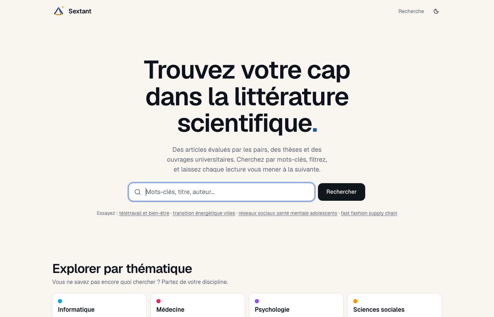
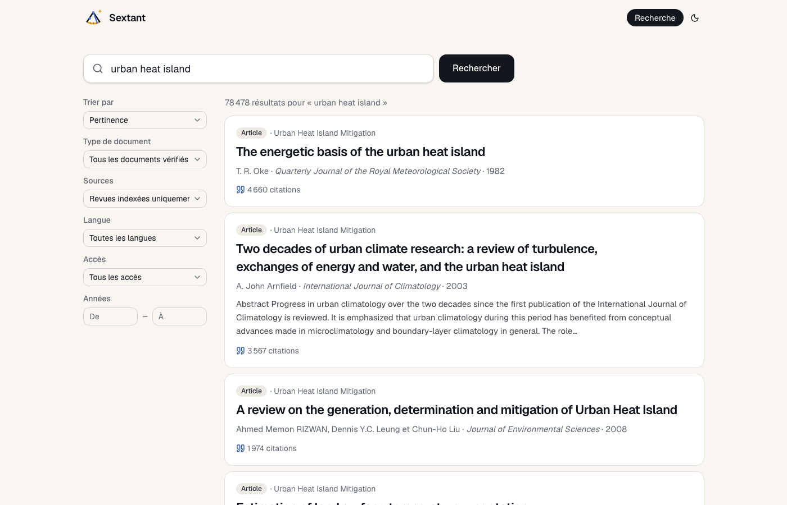
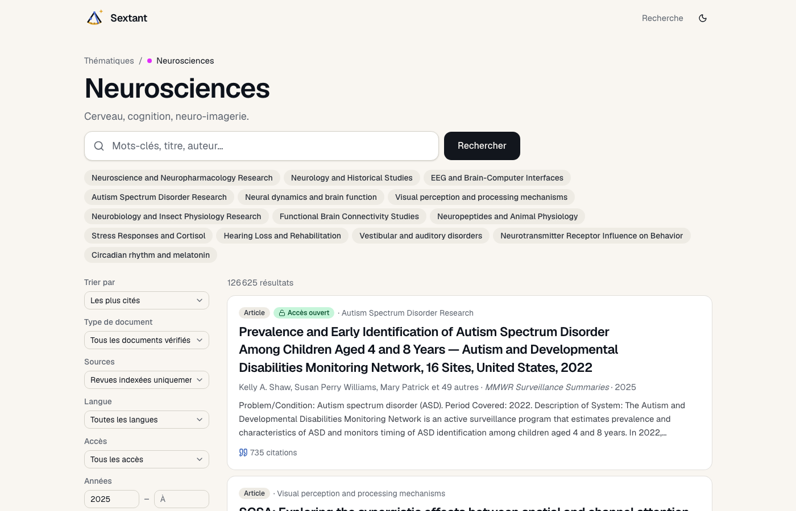

<div align="center">


# Sextant

**Trouvez votre cap dans la littérature scientifique.**

Un moteur de recherche et de découverte d'articles scientifiques, simple et soigné.<br/>
Pour les étudiant·es, les doctorant·es, et toutes les personnes curieuses.

🌐 **[Voir le site en ligne](https://sextant-psi.vercel.app/)** &nbsp;·&nbsp; 🐙 [Code source](https://github.com/LucasOtw/Sextant) &nbsp;·&nbsp; 🗺️ [Feuille de route](#️-feuille-de-route)



</div>

<br/>

## 🧭 Le projet en une phrase

Vous tapez quelques mots-clés, Sextant remonte des articles **évalués par les pairs**, des **thèses** et des **ouvrages universitaires**, avec des informations claires (auteurs, revue, année, citations), l'accès au **PDF quand il est libre**, et pour chaque article des **pistes pour continuer**. Pas de compte, pas de bruit, pas de presse.

> 🤝 **Un compagnon, pas un raccourci.** Sextant complète vos recherches sur Google Scholar, les bases de votre discipline et votre bibliothèque. Il ne les remplace pas.

<br/>

## ✨ Ce que vous pouvez faire

### 🔍 Chercher, et être guidé dès la frappe

Des suggestions apparaissent pendant que vous tapez : articles les plus cités correspondant à vos mots, thématiques proches. Entrée, et vous y êtes.



- 🎚️ **Filtres** : tri (pertinence, citations, date), type de document, sources, langue, accès ouvert, années.
- 🇫🇷 **Langue** : le filtre « Français » fait remonter la recherche francophone, souvent noyée ailleurs.
- 🧩 **Sous-thèmes** : depuis une thématique, des puces cliquables pour affiner sans réfléchir aux mots-clés.

### 📄 Une fiche article lisible


- 📥 **Lire le PDF** quand une version libre existe, sinon **Voir chez l'éditeur**.
- 📋 **Citer** en un clic : APA ou BibTeX dans le presse-papiers.
- ❤️ **Enregistrer** l'article dans vos favoris, puis le ranger dans une **liste** (« Mémoire 2026 », « Santé »…) pour vous y retrouver ; chaque liste s'exporte en BibTeX.
- 📝 **Noter** ce que vous retenez d'un article, pour vous seul, sur sa fiche.
- 🖍️ **Surligner** un passage du résumé ou du PDF (lecteur intégré pour les articles en accès ouvert) : il est gardé avec l'article, la page et la date. La page **Mes citations** rassemble tout, copiable avec sa référence APA prête à coller. Pas de PDF libre ? Saisissez la citation à la main.
- 👤 **Auteurs** : survolez un nom pour voir son institution (avec lien vers le site), ses articles, ses citations, son indice h, son ORCID.
- 🔗 **Pour aller plus loin** : les articles proches par le contenu, pour rebondir de lecture en lecture.
- 🧠 **L'essentiel en quatre points** : un condensé du résumé, traduit en français si besoin (voir plus bas).

### 🗂️ Explorer par thématique

Seize grands domaines, de l'informatique aux arts et humanités. Chaque thématique montre ses sous-thèmes les plus actifs et les articles récents les plus cités.



### 🌙 Confortable, de jour comme de nuit

Mode sombre en un clic, mémorisé. Historique local « Consultés récemment » pour reprendre où vous en étiez. Transitions douces, jamais tape-à-l'œil.


<br/>

## 🎯 Comment les articles sont choisis

La qualité passe avant la quantité. Sextant s'appuie sur [OpenAlex](https://openalex.org), la plus grande base bibliographique ouverte au monde, et n'en garde que le fiable :

| ✅ Ce qui remonte | ❌ Ce qui est écarté |
|---|---|
| Articles et revues de littérature évalués par les pairs | Préprints, éditoriaux, lettres, errata |
| Thèses de doctorat | Rapports, jeux de données, notices de couverture |
| Livres et chapitres universitaires | Documents rétractés |
| Par défaut, revues **indexées** (liste proche de Scopus / Web of Science) | Le filtre « Sources » permet d'élargir si besoin |

Les suggestions de la barre de recherche et les articles similaires suivent les mêmes règles.

<br/>

## 🧠 Le condensé par IA

Sur une fiche, un bouton condense le résumé original en quatre points : **question, méthode, résultat, portée**. En français, traduit si l'article ne l'est pas.

- 🇪🇺 Généré par un **modèle ouvert de [Mistral AI](https://mistral.ai)**, hébergé en Europe.
- 🏷️ Toujours signé : le fournisseur et le modèle sont affichés à côté du texte.
- 🧾 Toujours indicatif : la source fait foi. Lisez l'article, pas seulement sa synthèse.

<br/>

## 🔒 Vie privée

- Aucun compte, aucun cookie de suivi, aucune mesure d'audience, aucune publicité.
- Le mode d'affichage, le message d'accueil lu et l'historique de consultation restent **dans votre navigateur**.
- Seuls vos mots-clés partent vers OpenAlex, et seul le résumé public d'un article part vers Mistral, quand vous le demandez.

Détails : [Confidentialité](src/app/confidentialite/page.tsx) · [Conditions d'utilisation](src/app/conditions/page.tsx) · [À propos](src/app/a-propos/page.tsx)

<br/>

## 🗺️ Feuille de route

- [x] Recherche, filtres, thématiques, fiche article, similaires
- [x] Condensé par IA (Mistral)
- [x] Carte auteur au survol
- [x] Mode sombre, historique local, pages légales
- [x] Comptes (Google) et favoris synchronisés, export BibTeX
- [x] Listes de favoris (« Mémoire 2026 », « Santé »…)
- [x] Surligner dans le résumé ou le PDF, page « Mes citations » avec la source
- [x] Note personnelle sur un article ; listes avec description et ordre manuel
- [x] Partager une liste en lecture seule par lien (désactivable), export BibTeX pour le destinataire
- [x] Pages légales à jour, export de ses données (RGPD)
- [x] « Pour vous » : articles apparentés à vos favoris et lectures, et les plus cités de vos sujets, chaque suggestion expliquée et écartable
- [x] Serveur MCP : brancher sa bibliothèque Sextant à Claude ou ChatGPT, avec une clé personnelle révocable (« Mon compte »)
- [ ] Alertes sur un sujet ou un auteur
- [ ] Applications mobiles (après la version web)

<br/>

<details>
<summary><strong>🛠️ Sous le capot</strong> — pour celles et ceux qui veulent faire tourner ou contribuer</summary>

<br/>

**Stack** : Next.js 16 (App Router, Server Components) · React 19 · TypeScript · Tailwind CSS 4 · [shadcn/ui](https://ui.shadcn.com) · icônes Lucide.
**Données** : API OpenAlex (gratuite, sans clé, CC0). **IA** : API Mistral (offre gratuite), Groq / OpenRouter / Anthropic possibles.
**Hébergement** : Vercel, relié au dépôt GitHub `LucasOtw/Sextant` — chaque push sur `main` déploie la production, chaque branche a son aperçu (protégé par Vercel Authentication ; la clé Firebase de production doit être réservée à l'environnement Production dans les réglages Vercel). Les fonctions serveur tournent à Paris (`cdg1`, fixé dans `vercel.json`), à côté de la base Firestore (`europe-west9`).

### Démarrer

```bash
npm install
cp .env.example .env.local   # OPENALEX_API_KEY (clé gratuite, évite les limites anonymes) ; MISTRAL_API_KEY pour le condensé
npm run dev                  # http://localhost:3000
```

Comptes en local : la seule base Firestore est celle de la production. Par sécurité, `npm run dev` désactive les comptes
tant que `ALLOW_PROD_DB=1` n'est pas dans `.env.local` ; le reste du site fonctionne, sauf les listes partagées (`/liste/…`, « Liste indisponible »). Pour tester connexion, favoris,
listes ou suppression du compte sans toucher aux vraies données : `npm run dev:emu` (émulateurs Auth et Firestore sous le
projet `demo-sextant`, Java 21, données effacées à l'arrêt ; arrêter `npm run dev` avant, un seul serveur de dev à la fois).

### Pages et API

| Route | Rôle |
|---|---|
| `/` | Recherche, thématiques, sélection du moment, consultés récemment |
| `/search?q=…` | Résultats et filtres ; aussi `topic=`, `cites=`, `author=`, `lang=`, `type=`, `src=all` |
| `/theme/[slug]` | Une thématique : sous-thèmes + résultats |
| `/article/[id]` | Fiche article (identifiant OpenAlex `W…`) |
| `/a-propos`, `/conditions`, `/confidentialite` | Pages de texte |
| `GET /api/suggest?q=` | Suggestions de la barre de recherche |
| `GET /api/author?id=` | Profil court d'un auteur |
| `POST /api/summary` | Condensé par IA `{ id: "W…" }`, mis en cache |

### Organisation

```
src/
  app/            pages (App Router) + routes API
  components/     composants métier et ui/ (shadcn)
  lib/openalex.ts client OpenAlex typé (recherche, article, similaires, sujets, auteurs)
  lib/ai.ts       fournisseurs du condensé (Mistral par défaut)
  lib/format.ts   résumé, auteurs, APA / BibTeX, libellés
  lib/themes.ts   les 16 thématiques (slug → field OpenAlex)
  lib/recent.ts   historique local
docs/             logo, captures d'écran
tests/            tests unitaires (Vitest), fixtures et garde-fous
```

### Tests et CI

```bash
npm run lint           # ESLint, 0 avertissement toléré (règles jsx-a11y recommandées en erreur)
npm run typecheck      # types des routes générés (next typegen) puis tsc
npm test               # tests unitaires Vitest (tests/unit/)
npm run test:emulator  # transactions Firestore et suppression du compte, sur les émulateurs (tests/emulator/, Java 21)
npm run test:a11y      # Playwright + axe sur un site démarré (BASE_URL, par défaut http://localhost:3000)
npm run build
```

- Node 24 (`engines`, `.nvmrc`).
- Les tests unitaires ne touchent **jamais** la base (la seule base Firestore est celle de la production) : `@/lib/firebase/admin` y est remplacé par un module qui lève une erreur, `firebase-admin/app` aussi, `fetch` est interdit, les variables de secrets sont effacées et les identifiants par défaut de gcloud rendus introuvables (`vitest.config.mts`, `tests/setup.ts`). Session et stockage se simulent avec `vi.mock` (exemple : `tests/unit/api-notes.test.ts`).
- Les tests marqués `it.fails` décrivent un défaut connu de l'audit (QUAL-32) : le correctif retire `.fails`. Le DNS joker (`127.0.0.1.nip.io`) et les redirections vers une adresse privée sont couverts par `tests/unit/public-fetch.test.ts` (`node:dns` simulé, serveur local).
- `npm run test:emulator` démarre les émulateurs Firestore et Auth sous le projet `demo-sextant` (`firebase emulators:exec`), jamais celui de `.firebaserc`. Garde-fous : `adminApp()` n'accepte qu'un projet `demo-…` quand `FIRESTORE_EMULATOR_HOST` est défini, et `tests/emulator/setup.ts` refuse de démarrer si `FIREBASE_SERVICE_ACCOUNT` est présent ou si les émulateurs ne sont pas désignés. Cas couverts : limite de 1 000 favoris, index `favoriteIds`, retrait en cascade des listes, `CollectionOrderError`, partage et révocation, votes (et leur retrait à la suppression du compte), `createdAt` posé par le serveur, plafond des notes et export paginé, suppression du compte. Les firebase-tools du projet exigent Java 21 (`JAVA_HOME` vers un JDK 21).
- `npm run test:a11y` visite les pages publiques en clair et en sombre : échec sur les violations axe serious ou critical, sur `page-has-heading-one`, `landmark-one-main` et `region`, et sur tout débordement horizontal à 320 px. Toute requête autre que GET/HEAD est bloquée (les pages lisent la base de production). En local, avec le serveur de dev lancé : `PW_CHANNEL=chrome npm run test:a11y` (Chrome installé) ou `npx playwright install chromium` au préalable.
- GitHub Actions : `.github/workflows/ci.yml` rejoue lint, typage, tests unitaires et build (job `ci`), puis les tests sur émulateur (job `emulator`, Java 21), à chaque push et pull request vers `dev` et `main`, sans aucun secret. `.github/workflows/a11y.yml` lance le banc d'accessibilité sur chaque aperçu Vercel réussi (`deployment_status`) ; si les aperçus sont protégés, il lit le secret `VERCEL_AUTOMATION_BYPASS_SECRET`. Dependabot (`.github/dependabot.yml`) propose chaque lundi des mises à jour groupées vers `dev` ; les montées majeures de Next, firebase-admin, TypeScript et ESLint se font à la main sur une branche dédiée.

### Réglages hors du code

Les actions qui reviennent au propriétaire (Vercel, Firebase, GitHub) sont listées dans les notes de lot de `docs/handoffs/`, section « À faire par le propriétaire » : lot 1 (pare-feu Vercel, clé Mistral, budget) et lot 6 (sauvegarde Firestore, variables Vercel, fournisseurs de connexion, CSP et COOP).

### Branches

- `main` : version en ligne, ne reçoit que des merges depuis `dev`.
- `dev` : intégration ; les fonctionnalités arrivent par `feat/<nom>` et pull request vers `dev`.
- `dev` et `main` protégées : PR obligatoire, statuts `ci`, `emulator` et `Vercel` requis (réglage du dépôt, GitHub → Settings → Rules → Rulesets).

### Firestore

Toutes les lectures et écritures passent par le serveur (SDK Admin, clé de service). `firestore.rules` ferme tout accès direct depuis un navigateur : c'est aussi le réglage par défaut du mode « production » de la console, à conserver. Pour redéployer ces règles après modification : `firebase deploy --only firestore:rules` (CLI Firebase connectée au projet).

### Variables d'environnement

Voir [`.env.example`](.env.example). Sans clé IA, le bouton de condensé est simplement masqué.

</details>

<br/>

<div align="center">

Un **sextant** sert à faire le point et à tenir son cap. 🧭

</div>
